# All in the Cloud – NetScaler SD-WAN link aggregation, resiliency, link of last resort demo using **iPerf** 

Dramatically lower costs at the same time expand WAN capacity to you branch offices utilizing the NetScaler SD-WAN solution.  SD-WAN utilizes broadband connections to deliver high-priority application traffic with the same reliability and quality of service as expensive MPLS networks. This means enterprises can now expand their WAN capacity using low-cost, flexible broadband connections.  The newly added WAN circuits work seamlessly with an existing MPLS private networks utilizing the SD-WAN solution as an overlay network.  SD-WAN's per-packet processing technology allows a single TCP or UDP session to utilize multiple WAN links (MPLS, Internet, LTE, Satellite, etc) simultaneously.  The bandwidth bonding, per-packet processing, and sub-second convergences of sessions between paths is a key differentiator against many competing solutions and enables an always-on branch with high-end user experience.  The metered feature enables conservation of bandwidth on links that are billed based on usage.  This demonstration will highlight the link of last resort capability to use a backup 4G/LTE at the branch only when all other 

## Topology: All in the Cloud

This demonstration will access a VDI located in the Branch Office.  The VDI session will not flow through the SD-WAN solution, but applications within the VDI that connect to Data Center resources will be subject to WAN conditions.

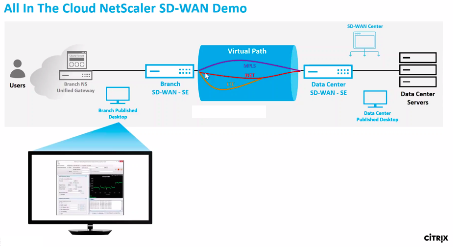

### Step 1

The Demo Center “Environment Provisioned” email will provide a URL and credentials to access the **Branch NetScaler ICA Gateway**.

It is recommended to use a Chrome browser in **“Incognito mode”** to access the environment as to prevent lingering cookies. Any persistency can cause inconsistent results across demo runs.

Log in using the supplied credentials for user1:

  **Username:** `Citrix\user1`
  **Password:** `<PROVIDED>`

On the Welcome to Citrix Receiver landing page, select *Detect Receiver* and click the option to Already Installed.

  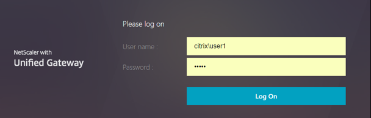

  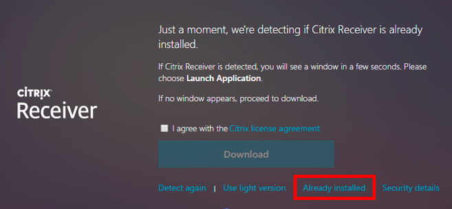

### Step 2

From the landing page of the user1 account navigate to **DESKTOPS**.

Select the Branch Office Desktop.  

>This VDI session is not accessed through the SD-WAN solution and is not subject to any changes on the WAN links.  Any applications that we launch **WITHIN** this session that connects back to the datacenter, will be effected by the WAN links conditions. 

Let the VDI be for now, we will come back to this launched branch VDI session in a later step.
  
  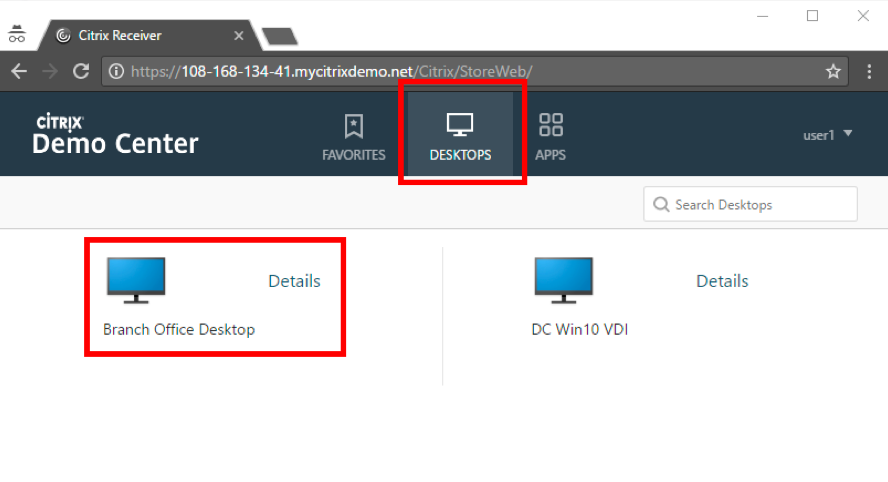

### Step 3

In the incognito browser, open a second tab to the SD-WAN SE located in the data center.  From the Provisioned Environment email locate the **Data Center SD-WAN VPX-SE** public FQDN URL.

Use the following credentials to login:

  **Username:** `admin`
  **Password:** `CtxPa55w0rd!`

 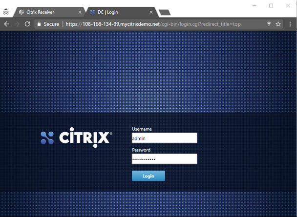

### Step 4

In the incognito browser, open a third tab to the WAN Emulator.  From the Provisioned Environment email locate the **WANem** public IP URL.

Here we will control the loss on the respective interfaces to bring down the individual WAN paths that are available between the two SD-WAN VPX-SE instances in this environment.

* **Eth1 and Eth2** = MPLS
* **Eth3 and Eth4** = INET
* **Eth5 and Eth6** = LTE

  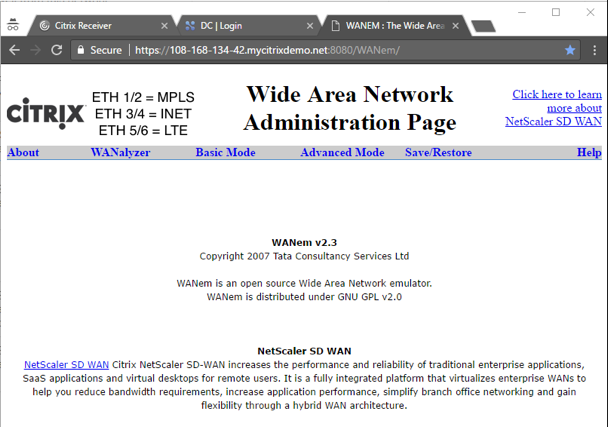

### Step 5 

We will purposely start by bringing down the INET WAN path to start with a typical customer starting environment with an active MPLS and a standby INET link.  Customers that are interested in SD-WAN typically see application delivery issues to these sites due to limited bandwidth on the single MPLS link that is active.

In the WANem GUI Click on **“Advanced Mode”**.

  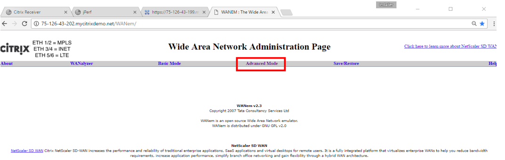

### Step 6

We will take down the **INET** path using the WANem by selecting `eth3` from the drop down list and clicking the **Start** button.

  >**Note that eth3 and eth4 on the WANem control the INET WAN link between the sites.**
  
  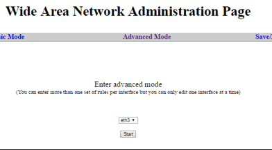

### Step 7 

In the **Loss%** field, enter the value **100** and click the **Apply settings** button.

  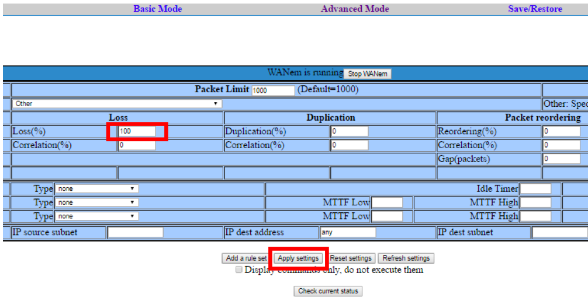

### Step 8

By taking down the INET path, the network looks similar to what is illustrated to right.

The paths that SD-WAN monitors, are susceptible to brownout and blackout conditions that under normal networks would impact the availability of the application, but with SD-WAN in the network path applications are protected and SD-WAN provides reliable delivery of all application with no disruption to the end user.

We can visually illustrate this with using the jPerf application.

  

### Step 9

Open the **Data Center SD-WAN VPX-SE** GUI and navigate to the **Monitoring > Statistics** page to see the available WAN Paths between virtual sites.  

Since there are three WAN links available at the remote site (MPLS, INET, LTE), the SD-WAN will monitor unidirectionally each WAN link, resulting in a total of six unique paths available for application delivery across the SD-WAN overlay. Both the INET and LTE path terminate into the single INET WAN link at the Data Center.  

With the WANem having 100% loss on `eth3`, we should notice that SD-WAN detects and reports that **failure on the Branch INET related paths**.

  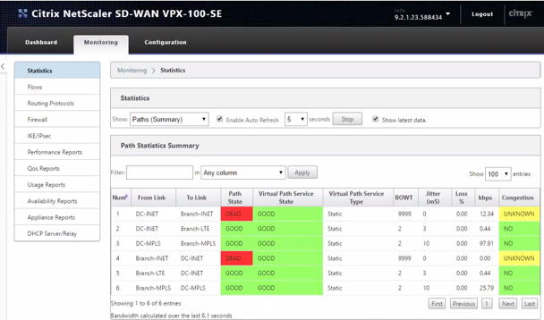

### Step 10 

**Enable Auto Refresh** on the SD-WAN path statistics page to monitor the latest statistic changes of the paths in 5 sec refresh intervals.

  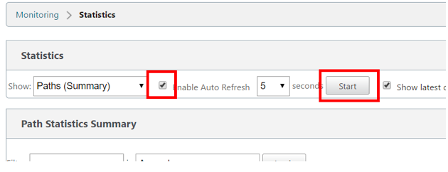

### Step 11

Each unidirectional path is measured for Best One-Way Time (BOWT), Jitter in mS, Loss % and path usage in kbps.

Closer investigation of the kbps column will show the usage of each WAN path.  

SD-WAN will purposely avoid using the LTE WAN links due to the active configuration where LTE is configured to be a Metered Link - Link of Last Resort.  This configuration only allows usage of the 4G/LTE link when no other WAN link is available for delivery, making it the last resort for the network. 

  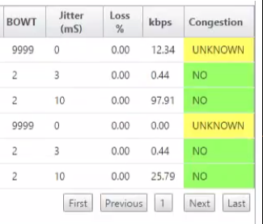

### Step 12 

Returning back to the Branch VDI session that we launched in a earlier step.  On the desktop of the Branch VDI session, double-click on the jPerf application shortcut.

jPerf will be used as a graphical tool to help users measure and visualize the available bandwidth between the Branch and Data Center sites.  From the Branch VDI host, the jPerf application will initiate a single TCP port 5001 session to a VM located in the Data Center across the current single MPLS WAN links.

  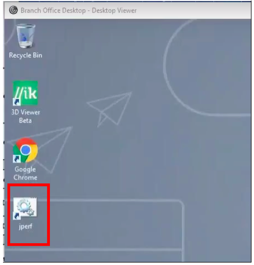

### Step 13

Within the jPerf application we can initiate communicate to the datacenter, which will be forced through the SD-WAN solution, allowing to showcase some of the features of SD-WAN.  

  1. Set transport layer protocol to TCP (default)
  2. Enable Client as the iPerf Mode (default)
  3. **Increase the transmit time to 1000 seconds** to keep iperf running for the duration of this exercise
  4. **Enter the iperf server address** located across the SD-WAN solution in the datacenter   (`192.168.15.9` or `iperf.citrix.lab`)
  5. Set the TCP port 5001 (default)
  6. Start the session by clicking the **“Run iPerf”** button

  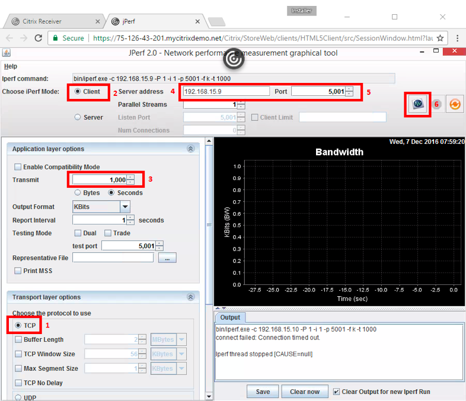

### Step 14

The jPerf will graphically show the available bandwidth between the sites, aggregating the bandwidth of an available WAN links.  To start it will only show the MPLS WAN link bandwidth at **~260kbps** since the INET WAN link was forced down with 100% loss.

The third LTE link goes unused, because the SD-WAN is pre-configured to use that link only as a *“link of last resort”*.

  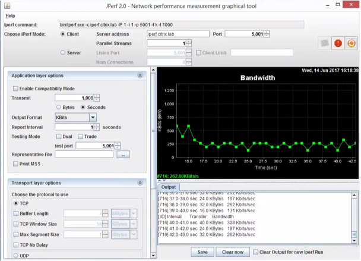

### Step 15

First, navigate back to the SD-WAN web interface, and navigate to the **Monitoring > Flows** page.

In the Filter field box, type in `5001` and click **Refresh** to display only the 5001 connection.

You should notice SD-WAN is monitoring the TCP 5001 session as using the `DC-MPLS-> Branch-MPLS` path.

To capture the path assignment on the reverse direction for the same session, you will need to log in to the Branch SD-WAN VPX-SE GUI.

  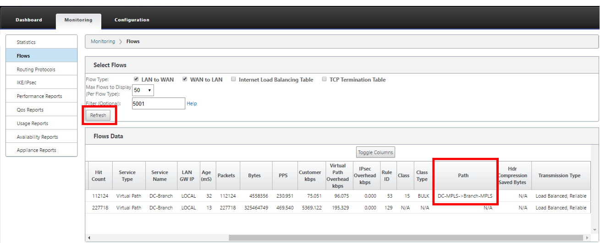

### Step 16 

Navigating to the SD-WAN Statistics page to monitor the statistic usage of the MPLS path for kbps.  MPLS is the only available path that SD-WAN can use for packet delivery, since the INET is down, and the LTE is configured as a last resort lin.

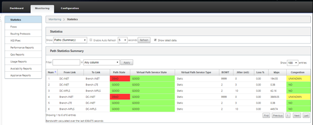

### Step 17 

Navigate back to the WANem GUI. **Revert the eth3 loss from 100% back to 0%** and monitor SD-WAN ability to seamlessly allow the single iPerf session to use two WAN links instantaneously without any session reestablishment required by the end user. 

Note that there is a slight delay before the application is aware of the added bandwidth.  In the SD-WAN Statistics page, if enabled for auto-refresh, the path state for INET will temporarily be placed in a yellow state to validate that it is a viable link before committing any traffic on that link. After that validation is when you will notice iPerf ramp up in its usage from 260kbps to 6Mbps.

> **This showcases the first differentiator of the NetScaler SD-WAN solution, delivery of a single session across two distinct WAN links, effectively utilizing all available bandwidth to send more data across the virtualized WAN. The result of this is much improved end-user experience with more richer content delivered.**

  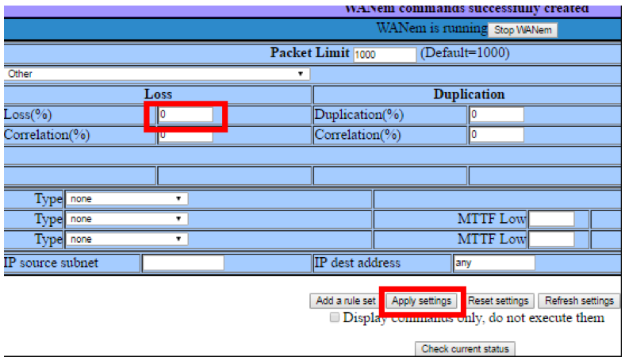

  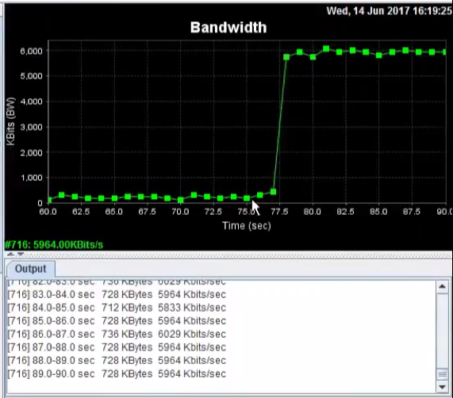

### Step 18

Next, we will showcase the resiliency of the NetScaler SD-WAN solution.

Navigate back to the WANem GUI.  **Bring down the MPLS link by adding 100% loss to eth1** and monitor SD-WAN ability to seamlessly allow the single iPerf session to use only the remaining INET link.

  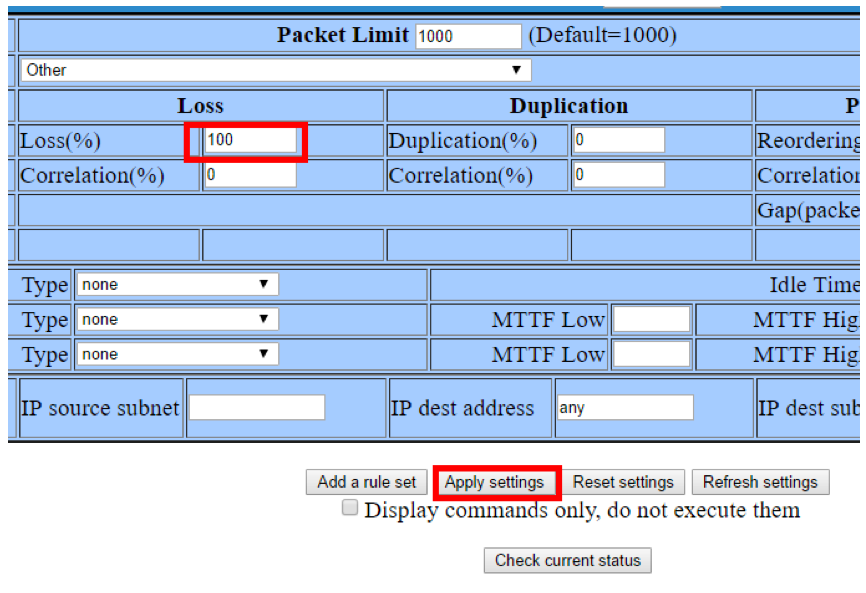
  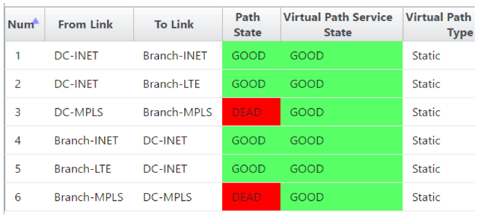

### Step 19

Once again, it should be noted that the iperf session continues to work with no disruption in the service.

The Jperf graph will output the available bandwidth of the currently only active INET link at ~5.5Mbps.

> **This showcases the second differentiator of the NetScaler SD-WAN solution, reacting to WAN link condition changes in milliseconds, allowing the session to continue to operate with no end-user disruption.**

  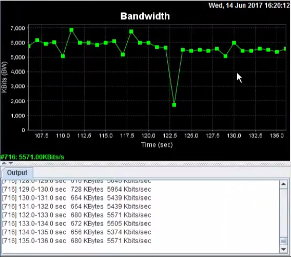

### Step 20 

Navigate back to the WANem GUI. **Bring down the INET link by adding 100% loss to eth5** and monitor SD-WAN ability to seamlessly allow the single iPerf session to use the last remaining LTE link with it being configured as a link of last resort.

  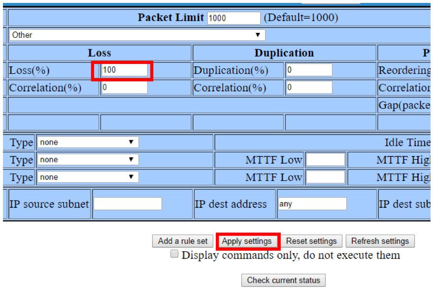

  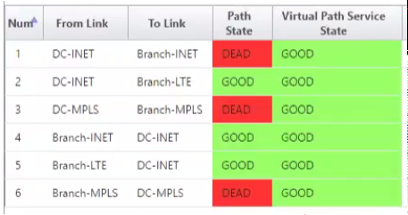

### Step 21

The iperf session continues to work with no disruption in the service.

The Jperf graph will output the available bandwidth of the currently only active **LTE link at ~2.6Mbps.**

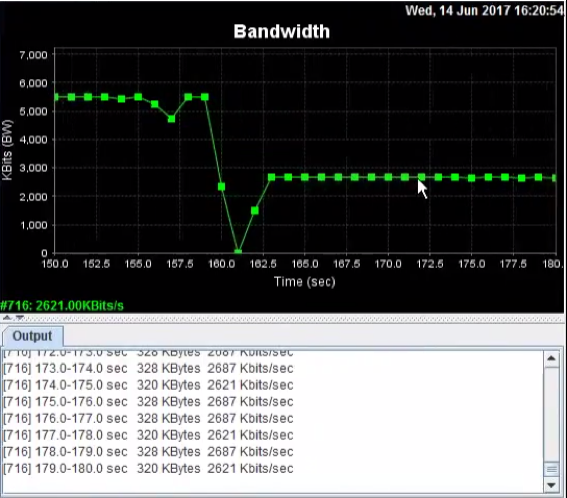

### Step 22

Navigate back to the WANem GUI.  **Bring up the MPLS link by putting back 0% loss for eth3.**

You can notice that the SD-WAN will transition the MPLS paths to a yellow analysis state before bringing it back to a good usable state, but as soon as it does and trusts the link to commit traffic to it, the jPerf graph will visually demonstrate how SD-WAN immediately stops using the costly 4G/LTE link and goes back to start using the non-metered paths that are available.

This concludes the demonstration of link aggregation, resiliency, and link of last resort functionality of NetScaler SD-WAN.

  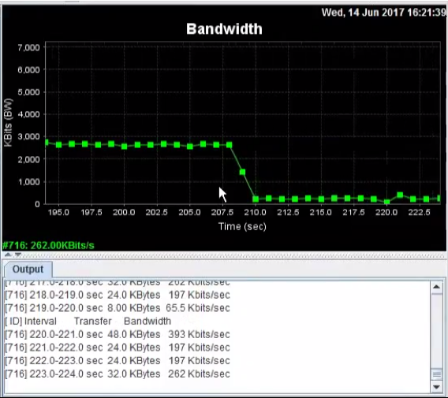

### Step 23

To properly close the session, stop the iPerf session by clicking the stop icon.

  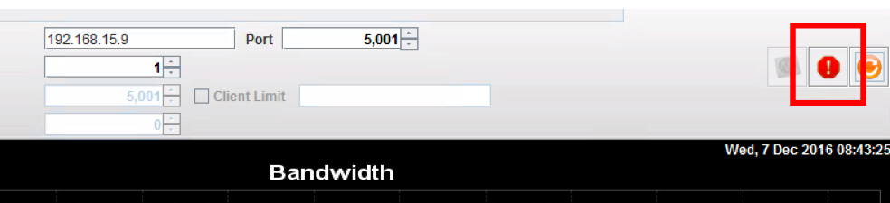

### Step 24

Cleanly log off the Branch VDI session by right clicking on Start, and choosing the Shut down or sign out option, then properly **Sign out**.

If you do not follow this procedure to properly sign out of the VDI session, you may encounter hung ICA sessions which would impact your next attempt of the same demo.

  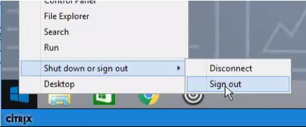

## Summary

This demonstration showcases that a single session between two host machines can simultaneously leverage all available WAN bandwidth, even across multiple unique paths, and the session is not limited to the bandwidth available on the single WAN path the session is initially assigned to.  With SD-WAN a session can be delivered across two paths simultaneously. This is a differentiator against most competing SD-WAN solutions, and is only accomplished by processing every packet and delivering the packet across a unique WAN path regardless of what path the previous packets took.
