# All in the Cloud - NetScaler SD-WAN link aggregation, resiliency, link of last resort demo using **Citrix HDX (Native Receiver)**

The following exercise demonstrates the same key points outlined in the previous exercise, but utilizes a different visual to further illustrate the benefit to the end user experience and application delivery when NetScaler SD-WAN is integrated into the network.  
This demonstration not only shows the link aggregation capabilities but also the resiliency of the application across multiple WAN Paths, leveraging a common application which consumes a lot of WAN bandwidth, video.  Even when delivered across the Citrix HDX protocol, video demands a lot of bandwidth to be delivered with the highest end user experience.  Most networks cannot sustain high resolution video delivery to branch users, because their WAN links are limited and often oversubscribed, severely impacting the user experience. The Citrix HDX protocol is designed to adapt to poor link conditions and to attempt to provide the best experience whenever possible.

This exercise will showcase how the SD-WAN solution seamless migrates a session from a single WAN Path to utilize multiple WAN paths simultaneously, further illustrating how the SD-WAN does not tie an application to a particular WAN path, but rather allows the application to take the most optimal path at any given time, or both paths simultaneously with its per-packet intelligent decision making.  We can experience the difference in user experience when HDX is being delivered across a single congested link, as compared to being delivered across multiple aggregated WAN links made possible by the NetScaler SD-WAN.

## Topology 

This demonstration will access a VDI located in the Data Center.  The VDI session will flow through the SD-WAN solution, and it can be seen as a HDX port 2598 connection in the Flows table of SD-WAN.

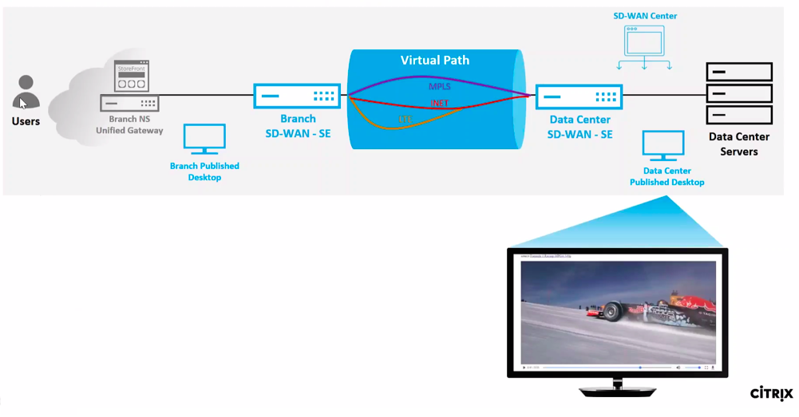

### Step 1

The Demo Center “Environment Provisioned” email will provide a URL and credentials to access the **Branch NetScaler ICA Gateway.**

It is recommended to use a Chrome browser in “Incognito mode” to access the environment as to prevent lingering cookies.  Any persistency can cause inconsistent results across demo runs.

Log in using the supplied credentials for **user1**:

  **Username:** `Citrix\user1`
  **Password:** `<Provided>`

On the Welcome to Citrix Receiver landing page, If you are using Chrome Browser, select *Detect Receiver* and click the option of *Already Installed*.

  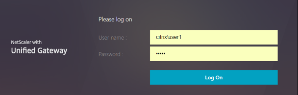

  

### Step 2

From the landing page of the user1 account navigate to **DESKTOPS**.

Select the **DC Win10 VDI**.  

> **Unlike the previous exercise, this VDI session is accessed through the SD-WAN solution and WILL BE SUBJECT TO ANY CHANGES ON THE WAN LINKS we initiate using the WAN emulator.**

  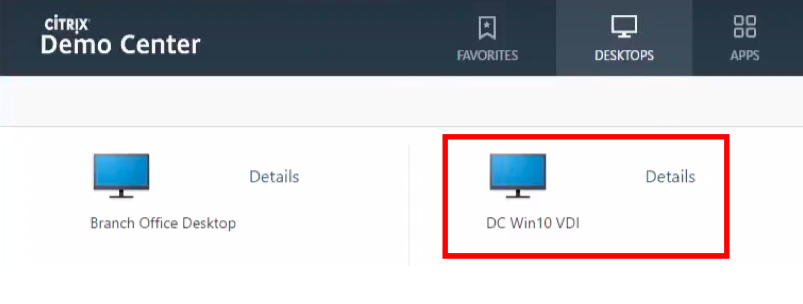

### Step 3

In the incognito browser, open a second tab to the SD-WAN SE GUI which is located in the data center.  From the Provisioned Environment email locate the **Data Center SD-WAN VPX-SE** public FQDN URL.

Use the following credentials to login:
  
  **Username**: `admin`
  **Password**: `CtxPa55w0rd!`

  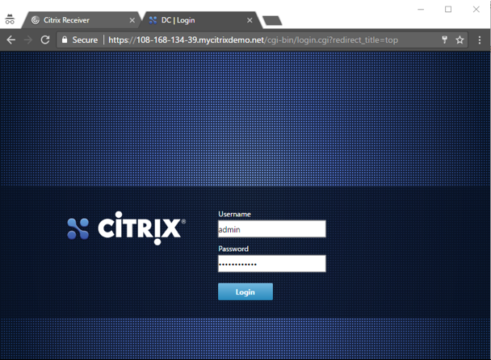

### Step 4

In the incognito browser, open a third tab to the WAN Emulator.  From the Provisioned Environment email locate the **WANem public FQDN URL**.

Here we will control the loss on the respective interfaces to bring down the individual WAN paths that are available between the two SD-WAN VPX-SE instances in this environment.

* **Eth1 and Eth2** = MPLS
* **Eth3 and Eth4** = INET
* **Eth5 and Eth6** = LTE

  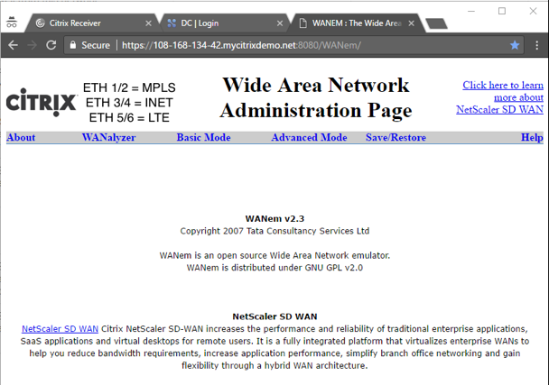

### Step 5

We will purposely start by bringing down the INET WAN path to start with a typical customer starting environment with an active MPLS and a standby INET link.  Customers that are interested in SD-WAN typically see application delivery issues to these sites due to limited bandwidth on the single MPLS link that is active.

In the WANem GUI Click on **“Advanced Mode”**.

  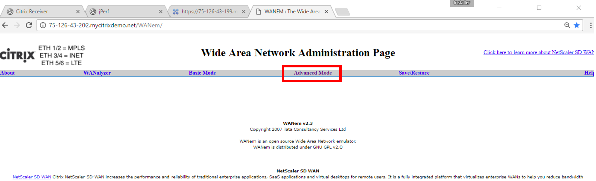

### Step 6

We will take down the INET path using the WANem by selecting **eth3** from the dropdown list and clicking the *Start button**.

> Note that eth3 and eth4 on the WANem controls the INET WAN link between the sites.

  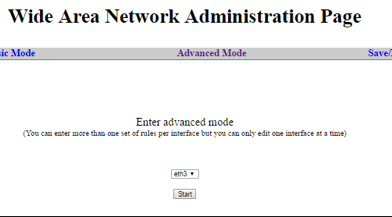

### Step 7 

In the **Loss%** field, enter the value **100** and click the **Apply** settings button.

  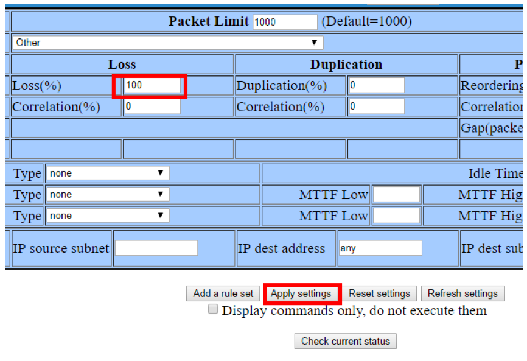

### Step 8 

By taking down the INET path, the network looks similar to what is illustrated to right.

The paths that SD-WAN monitors, are susceptible to brownout and blackout conditions that under normal networks would impact the availability of the application, but with SD-WAN in the network path applications are protected and SD-WAN provides reliable delivery of all application with no disruption to the end user.

  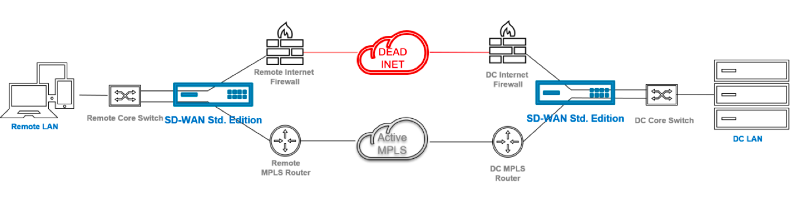

### Step 9 

Open the **Data Center SD-WAN VPX-SE GUI** and navigate to the **Monitoring > Statistics** page to see the available WAN Paths between virtual sites. 

Since there are three WAN links available at the remote site (MPLS, INET, LTE), the SD-WAN will monitor unidirectionally each WAN link, resulting in a total of six unique paths available for application delivery across the SD-WAN overlay. Both the INET and LTE path terminate into the single INET WAN link at the Data Center.  

With the WANem having 100% loss on eth3, we should notice that SD-WAN detects and reports that failure on the Branch INET related paths.

  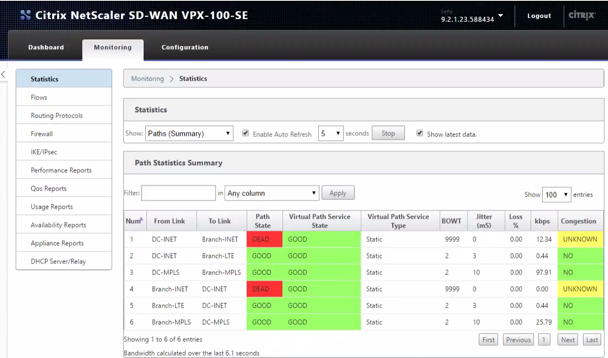

### Step 10

Returning to the Data Center VDI session that we launched in an earlier step.  On the desktop of the VDI session, open a Chrome browser which will have a default webpage set to a video server `https://192.168.15.11`

  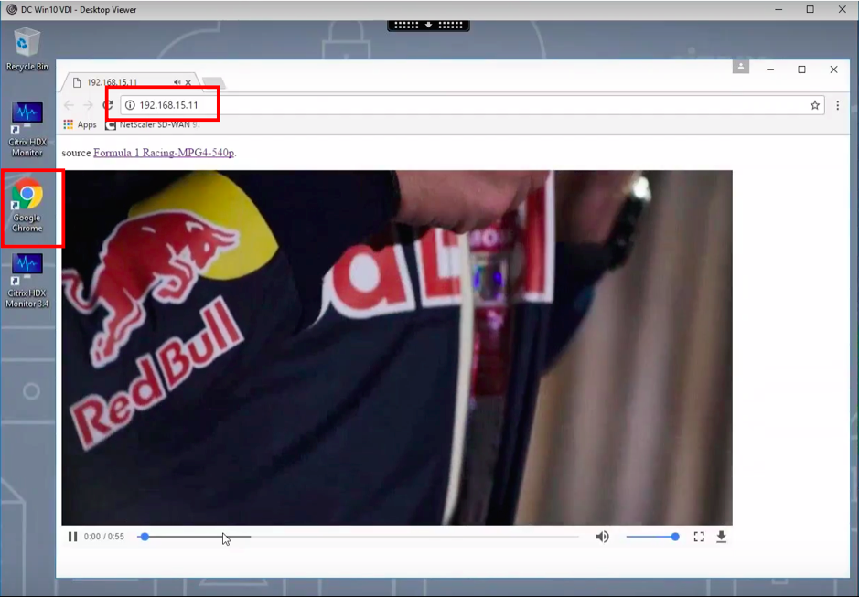

### Step 11

What you should notice choppy and pixelated video that the VDI session is delivering.  This is due to the single MPLS link that is available on the network.  
The single MPLS link is purposely configured for a low 300kbps of available bandwidth to represent a commonly low bandwidth MPLS link that is either congested or is purposely low capacity due to cost.

This provides the before picture of a customer network.

  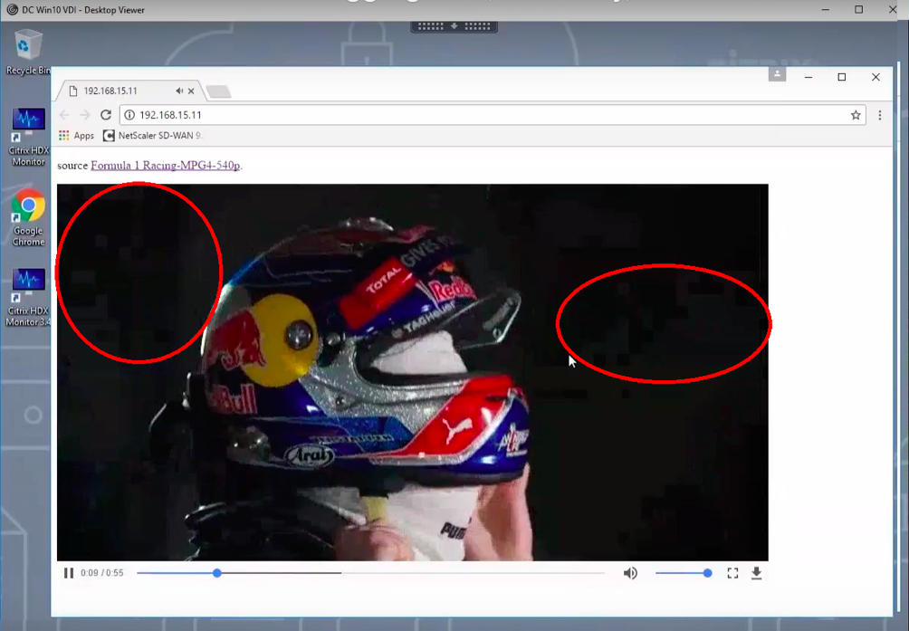

### Step 12

Navigating to the SD-WAN Statistics page to monitor the statistic usage of the MPLS path for kbps.  MPLS is the only available path that SD-WAN can use for packet delivery, since the INET is down, and the LTE is configured as a last resort link.

  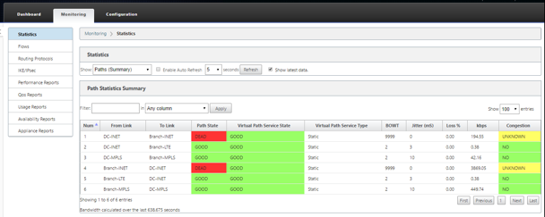

### Step 13

Navigate back to the WANem GUI. **Revert the eth3 loss from 100% back to 0%** and monitor SD-WAN ability to seamlessly allow the single HDX session to use two WAN links instantaneously without any session reestablishment required by the end user. 

  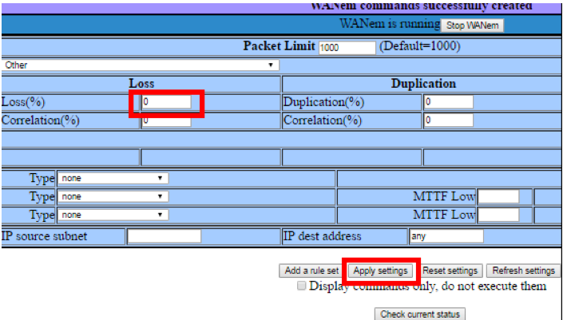

Note that there is a slight delay before the HDX application is aware of the added bandwidth.  In the SD-WAN Statistics page, if enabled for auto-refresh, the path state for INET will temporarily be placed in a yellow state to validate that it is a viable link before committing any traffic on that link.  After that validation is when you will notice the HDX video quality increases, eliminating much of the pixilation and providing a smoother video.

  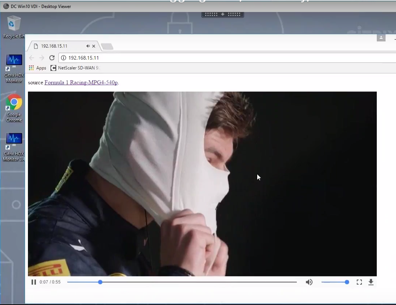

>**This showcases the first differentiator of the NetScaler SD-WAN solution, delivery of a single session across two distinct WAN links, effectively utilizing all available bandwidth to send more data across the virtualized WAN.  The result of this is much improved end-user experience with more richer content delivered.**

### Step 14

Next, we will showcase the resiliency of the NetScaler SD-WAN solution.

Navigate back to the WANem GUI.  Bring down the MPLS link by adding **100%** loss to **eth1** and monitor SD-WAN ability to seamlessly allow the HDX session to use only the remaining INET link.

  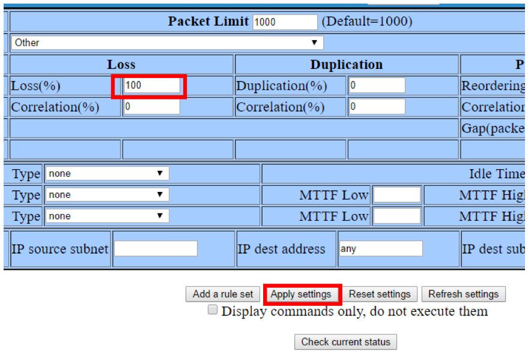
  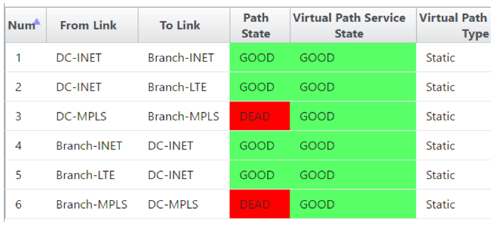

### Step 15

On the WANem GUI.  Next **bring down the INET link by adding 100% loss to eth5** and monitor SD-WAN ability to seamlessly allow the HDX session to use the last remaining LTE link with it being configured as a link of last resort.

One by one the WAN links have been eliminated and the solution is able to successfully delivery the published desktop with no disputation to the end user.

  
  

>**This showcases the second differentiator of the NetScaler SD-WAN solution, reacting to WAN link condition changes in milliseconds, allowing the session to continue to operate with no end-user disruption.**

### Step 16

Navigate back to the WANem GUI. **Bring up the MPLS link by putting back 0% loss for eth3**.

You can notice that the SD-WAN will transition the MPLS paths to a yellow analysis state before bringing it back to a good usable state, but as soon as it does and trusts the link to commit traffic to it, the HDX session will be impacted with its ability to deliver the video due to the lower bandwidth available on the MPLS link.  SD-WAN immediately stops using the costly 4G/LTE link and goes back to start using the non-metered paths that are available.

This concludes the demonstration of link aggregation, resiliency, and link of last resort functionality of NetScaler SD-WAN.

  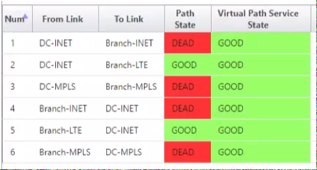
  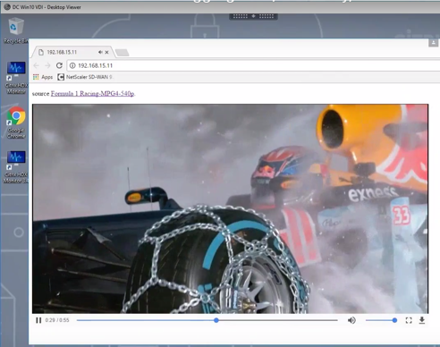

### Step 17

As always, make sure to cleanly log off the VDI session by right clicking on Start, and choosing the Shut down or sign out option, then properly Sign out.

If you do not follow this procedure to properly sign out of the VDI session, you may encounter hung ICA sessions which would impact your next attempt of the same demo.

  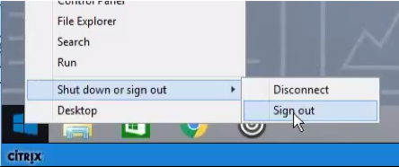

## Summary 

This demonstration again shows how SD-WAN can deliver a video session across two unique paths simultaneously, but also showcased how fast SD-WAN is to react against WAN path condition changes such as blackouts, within 2-3 packets SD-WAN detects the change and reroutes traffic accordingly.  The reaction time of SD-WAN is another differentiator against most competing SD-WAN solutions, and is only accomplished by processing every packet and delivering the packet across a unique WAN path regardless of what path the previous packets for that sessions took.  The result is dramatically improved end user experience.
