# Integrated firewall to block Internet traffic

The following exercise steps through the new Integrated Firewall for the NetScaler SD-WAN solution.  The environment will be provisioned with the needed configuration to block Facebook traffic at the Branch Office VDI.  This demonstration will showcase NetScaler SD-WAN’s capability of serving as a WAN edge firewall and to protect the network using its deep packet inspection capability to block or allow traffic based on its deep application classification capability.

## Topology

This demonstration will access a VDI located in the Branch Office.  The VDI session will not flow through the SD-WAN solution, but applications within the VDI that connect to Data Center resources will be subject to WAN conditions.

  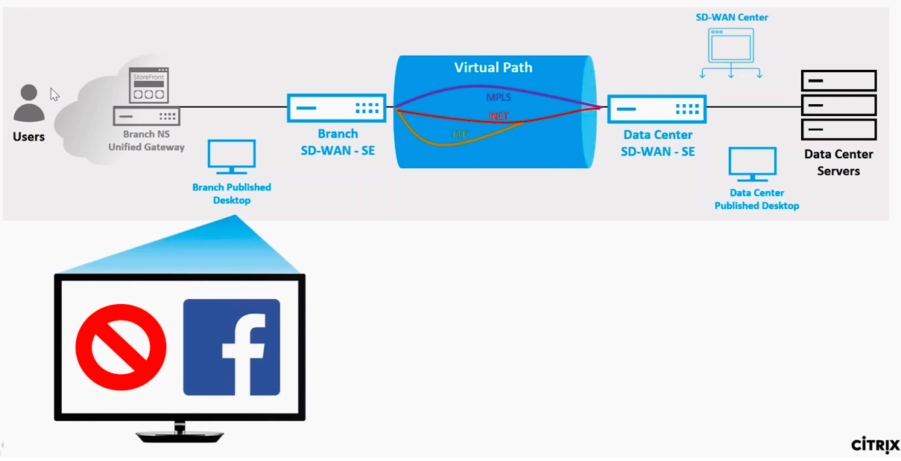

### Step 1

The Demo Center “Environment Provisioned” email will provide a URL and credentials to access the **Branch NetScaler ICA Gateway**.

It is recommended to use a Chrome browser in **“Incognito mode”** to access the environment as to prevent lingering cookies. Any persistency can cause inconsistent results across demo runs.

Log in using the supplied credentials for user1:

  **Username:** `Citrix\user1`
  **Password:** `<PROVIDED>`

On the Welcome to Citrix Receiver landing page, select *Detect Receiver* and click the option to Already Installed.

  

  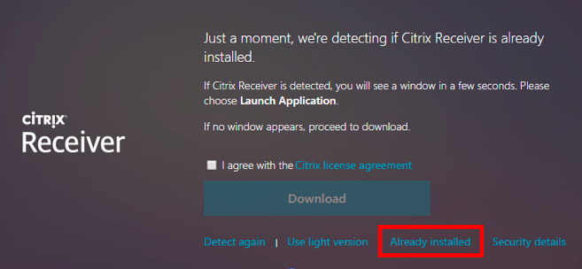

### Step 2

From the landing page of the user1 account navigate to DESKTOPS.
Select the Branch Office Desktop.  

This VDI session is not accessed through the SD-WAN solution and is not subject to any changes on the WAN links.  Any applications that we launch within the session that connects to the datacenter, will be effected by the WAN links conditions. 

  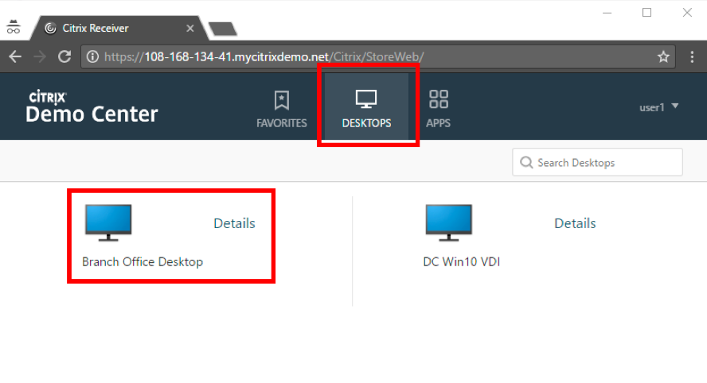

### Step 3

After the VDI launches, open a Chrome browser in the VDI session and attempt to navigate to the facebook.com.

You should notice that the website is blocked with the following error code: `ERR_CONNECTION_RESET.`

This is because the Cloud environment is provisioned with a pre-built configuration to allow direct Internet access at the branch and to Reject all Facebook traffic.

Navigating to any other website will be allowed by the pre-built configuration.

  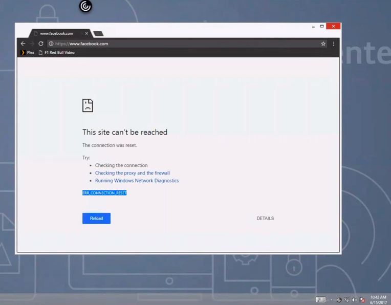

### Step 4

On your personal desktop, open the GUI access to the Branch Office SD-WAN SE using a supported Chrome or Firefox browser.  From the Provisioned Environment email locate the Branch Office SD-WAN VPX-SE public IP URL.

Use the following credentials to login:
  * **Username:** `admin`
  * **Password:** `CtxPa55w0rd!`

  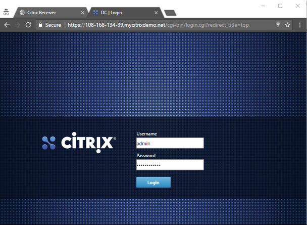

### Step 5

Since Facebook access was blocked at the Branch side VDI, we need to access the GUI local to that site to see the reporting.

One the Branch side SD-WAN VPX-SE, navigate to Monitoring > Firewall page, and select “Filter Policies” from the drop down.

Here you will see the filter policies that were hit, as well as detail on zone, action, packet, byte count.

  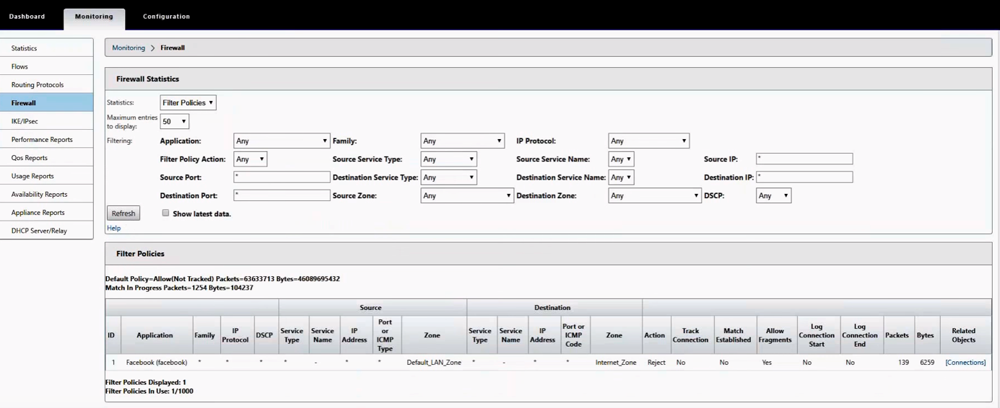

### Step 6

Next, we will open the current configuration file for the All in the Cloud demo and alter it to allow Facebook traffic for this particular site.

The Demo Center “Environment Provisioned” email will provide a URL and credentials to access the **SD-WAN Center Console**.

Use the following credentials to login:

  * **Username:** `admin`
  * **Password:** `CtxPa55w0rd!`

  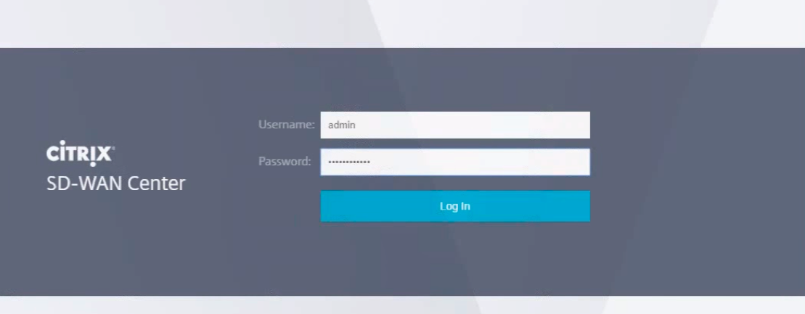

### Step 7

In SD-WAN Center navigate to the **Configuration > Network Configuration** page, and click the Open button to open the “InTheCloud” configuration file, which is the default configuration that will be enabled for every provisioned 
environment.

  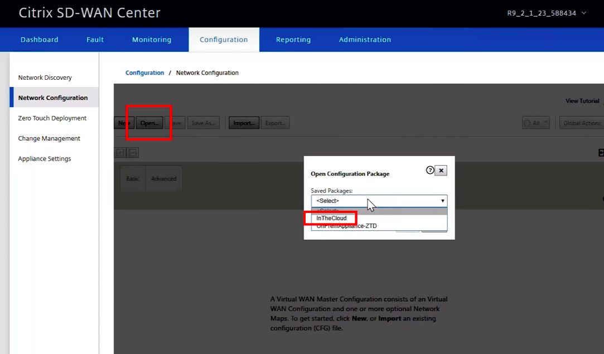

### Step 8 

Within the configuration, navigate to the **Connections** tile, to open the **Branch > Firewall > Policies** node. 

  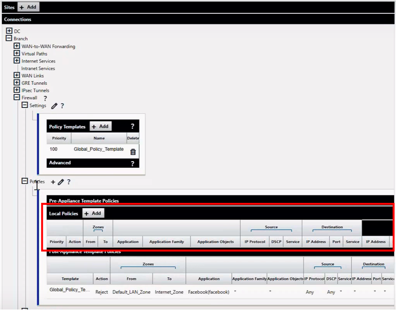

Here we can create Local Policies for the Branch site that will override any Post-Policies that are created globally in the configuration using the `Global_Policy_Template`.

### Step 9

In the Local Policies for the Branch, click the + add button to create a Facebook allow policy that will override the default post-policy to reject that traffic for this site.
In the Edit Firewall Policy pop-up window, populate the following settings:
  
  * From Zone = `Default_LAN_Zone`
  *	To Zone = `Internet_Zone`
  *	Action = `Allow`
  *	Match Type = `Application`
  *	Application = `Facebook(facebook)`

Click **Apply** to accept the new policy into the Local Policy for the branch which will override the default policy to reject the target application.

  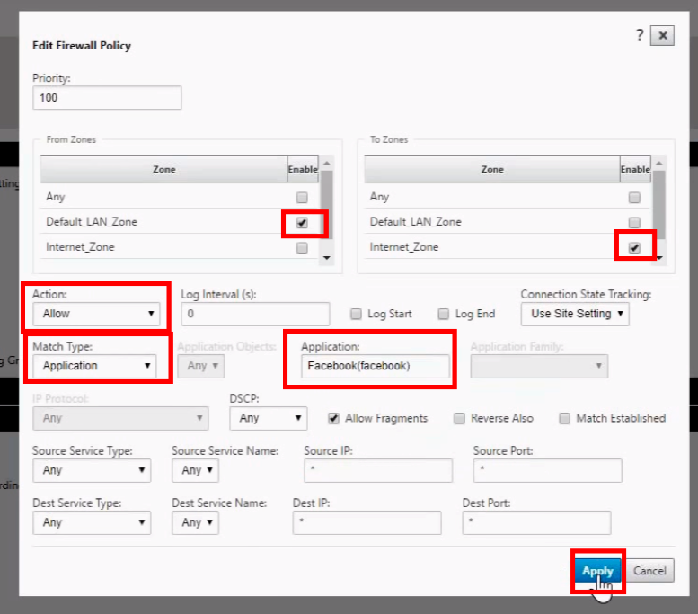

### Step 10 

With the new configuration ready, Save and Export the configuration to prepare to push out to the SD-WAN devices in the network to start using the newly created firewall policy.

  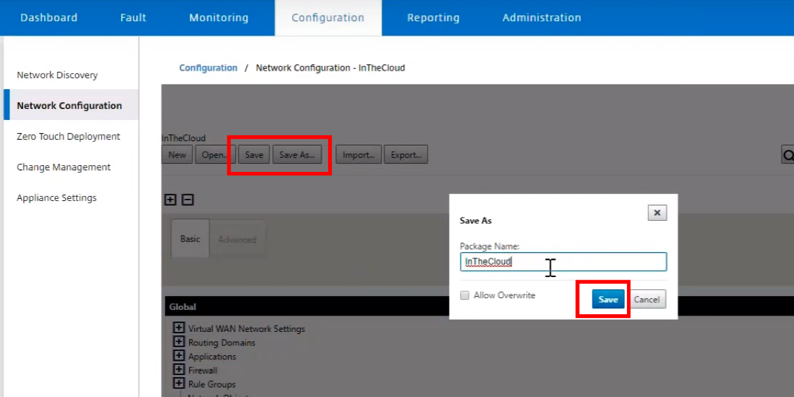

### Step 11

In the Change Management page of SD-WAN make sure your new configuration file was properly export and is available in the Configuration Inbox, then step through the change management to push this new configuration.

  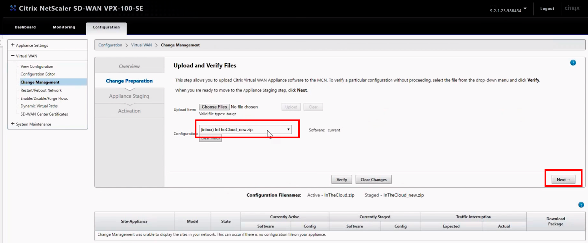

### Step 12

After the configuration has been pushed out to the SD-WAN devices, navigate back to the Branch VDI session.

Open a new Chrome Browser in incognito mode and attempt to navigate to Facebook.com.  This time the website should be successful since the Firewall Policy is in place to allow the traffic overriding the default policy.

  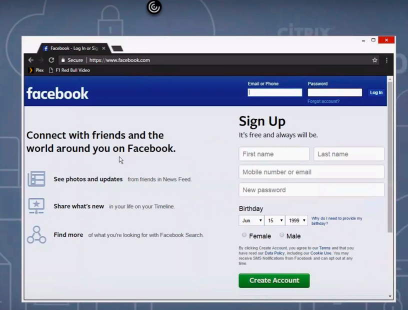

### Step 13

Navigating back to the **Monitoring > Firewall** page of the Branch SD-WAN VPX-SE we can see a new entry of the firewall policy that shows the hit policy and the action to allow the traffic.

  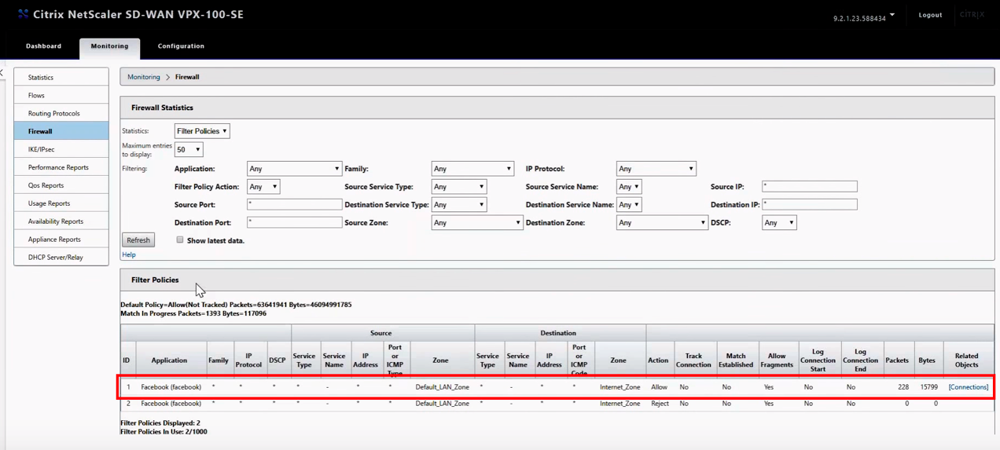

### Summary

This exercise demonstrates the integrated stateful firewall available on the NetScaler SD-WAN solution.  It also highlights the deep packet inspection, powered by QOSMOS, capability of the solution that can differentiate based on URL and can differentiate between sub-applications.

