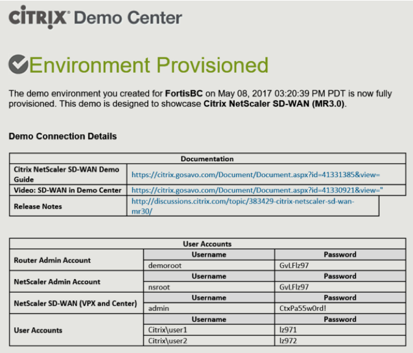
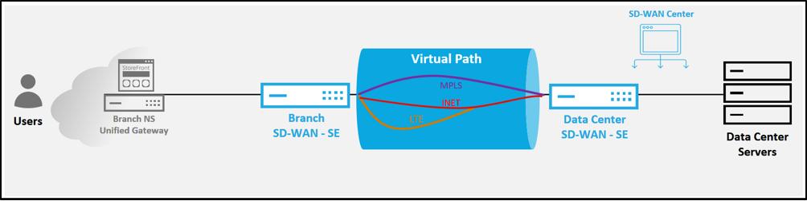

# Introduction 

This repository serves as a guide to help prospective customers and partners successfully use available components in Citrix Demo Center to deliver an effective NetScaler SD-WAN demonstration. The NetScaler SD-WAN demo is a simple approach to show customers some of the latest capabilities of the [Citrix SD-WAN](https://www.citrix.com/products/netscaler-sd-wan/) solution using an environment that has already been configured and validated for you. The provisioned environment allows for quick demonstration using an *"all in the cloud”* setup which includes the remote office and datacenter SD-WAN to showcase link aggregation and application delivery resiliency utilizing three pre-configured WAN Links (MPLS, Internet, and 4G/LTE). The configuration can easily be altered to delivery an even more effective demonstration making use of a physical on premise appliance. The “single appliance on-prem” setup will allow connectivity to the same cloud infrastructure in [Demo Center](demo.citrix.com) and add additional demonstration capability such as [zero touch deployment](https://docs.citrix.com/en-us/netscaler-sd-wan/9-1/zero-touch-deployment-service.html), [physical cable cut demo](https://www.youtube.com/watch?v=Ts4b3JJACKI), and demonstration of [Enterprise Edition](https://www.citrix.com/products/netscaler-sd-wan/netscaler-data-sheet.html) features.

### Accessing your Environment

>**ATTENTION** To view this POC environment, Please reach out to your Sales representative or Call 1 866 NETSCALER (866 638 7225) to speak to one directly about NetScaler SD WAN. 

Every Demo Center demo environment gets provisioned with all the required pre-configured virtual machines needed to demonstrate the solution.  The Environment Provisioned email will contain all the detail on how to connect into your personal environment, including public IP access to the individual virtual machines.

### Overview of SD-WAN “All in the Cloud” Demo

The SD-WAN “all in the cloud” demo is a self-contained environment hosted on a single XenServer 6.5 hypervisor in the SoftLayer cloud with components that enable demonstration of Citrix solutions. For the SD-WAN environment, two SD-WAN VPX (Virtual appliance) are used to show the bonding ability of multiple WAN paths; an MPLS (Multi-Protocol Label Switching) private WAN, public broadband Internet link, and simulation of a wireless 4G/LTE circuit. SD-WAN will monitor and utilize the aggregated bandwidth on the links to provide a virtualized path between the remote office and the data center site.

The Internet and MPLS WAN links are simulated with a virtual WAN emulator between the SD-WAN VPX devices.  The speed for each WAN link is controlled by the speed configured on each respective SD-WAN interface and must be altered through the Configuration Editor tool and Change Management process.  The WANem device can be used to induce latency and loss characteristics to mimic blackout and brownout WAN path conditions typically encountered in the network.

>**NOTE:** “The speed for each WAN link is controlled by the speed configured on each respective SD-WAN interface” This means changing bandwidth only on the WAN emulator Admin page is not going to have desirable outcomes on the demo. Changing desired WAN link bandwidth must be done on the SD-WAN configuration and WANem should not be configured to throttle any bandwidth.

### Required Components:

* **Provisioned Demo Center:** Cloud Networking NetScaler SD-WAN MR4 environment
* **Laptop with Citrix Receiver installed** (Optionally HTML5 receiver can be used)
* **Decent Internet connectivity** to Demo Center environment

  >**Note:** A decent Internet connection is required, particularly for the *"all in the cloud"* demonstrations given the fact users are accessing the cloud hosted demo environment through their inherent WAN connection. The modulated virtual WAN hosted all in the cloud offers a maximum of aggregated 10 Mbps connection to simulate Branch to DataCenter WAN conditions --therefore it is **expected** the demo admin have significantly greater bandwidth and a low latency in order to mitigate any external effects from a local WAN connection to the cloud demo environment itself. 

### SD WAN "All in the Cloud" Topology 

### Access Methods

For the SD-WAN “all in the cloud” demo, the NetScaler Unified Gateway at the Branch Office provides the entry point to the virtual environment using the HDX protocol. The Branch Office VDI can be accessed through NetScaler Gateway to initiate application for session communication which is controlled to go through the SD-WAN paired setup to the Data Center.

The following demonstration scripts can be used to highlight some of the key features of NetScaler SD-WAN using the “All in the Cloud” environment.

## Demonstration Tutorials for SD WAN Standard Edition 

Below are recorded demonstrations of how to administer the provisioned Demo environment. Click on any title to drill into procedures on how to delivery the demo.

### [Exercise 1: NetScaler SD-WAN link aggregation and resiliency with iPerf](./Exercise-1)

### [Exercise 2: NetScaler SD-WAN link aggregation, link resiliency, link of Last Resort with HDX](./Exercise-2)

### [Exercise 3: – NetScaler SD-WAN integrated application firewall ](./Exercise-3)

